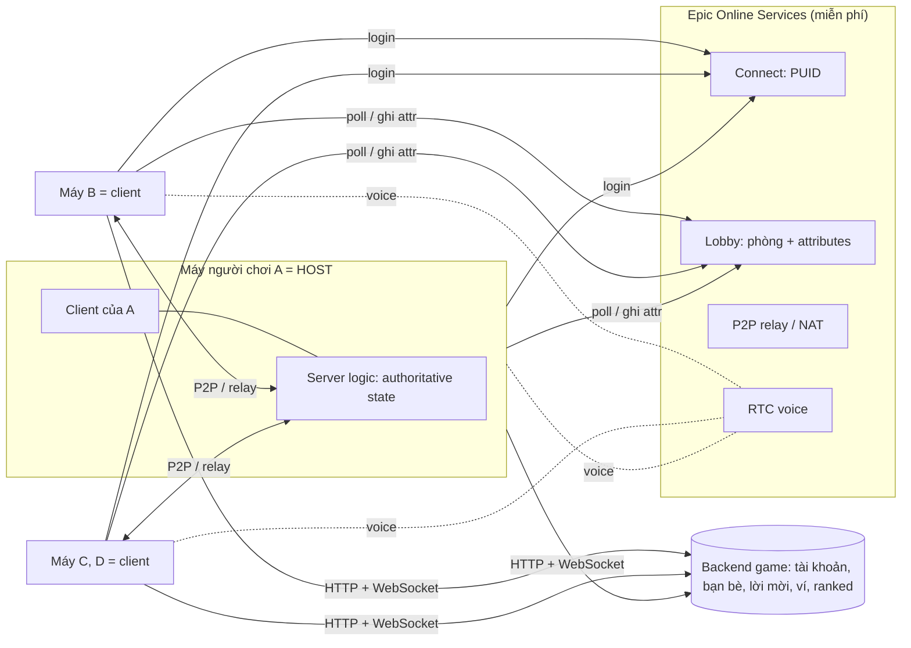
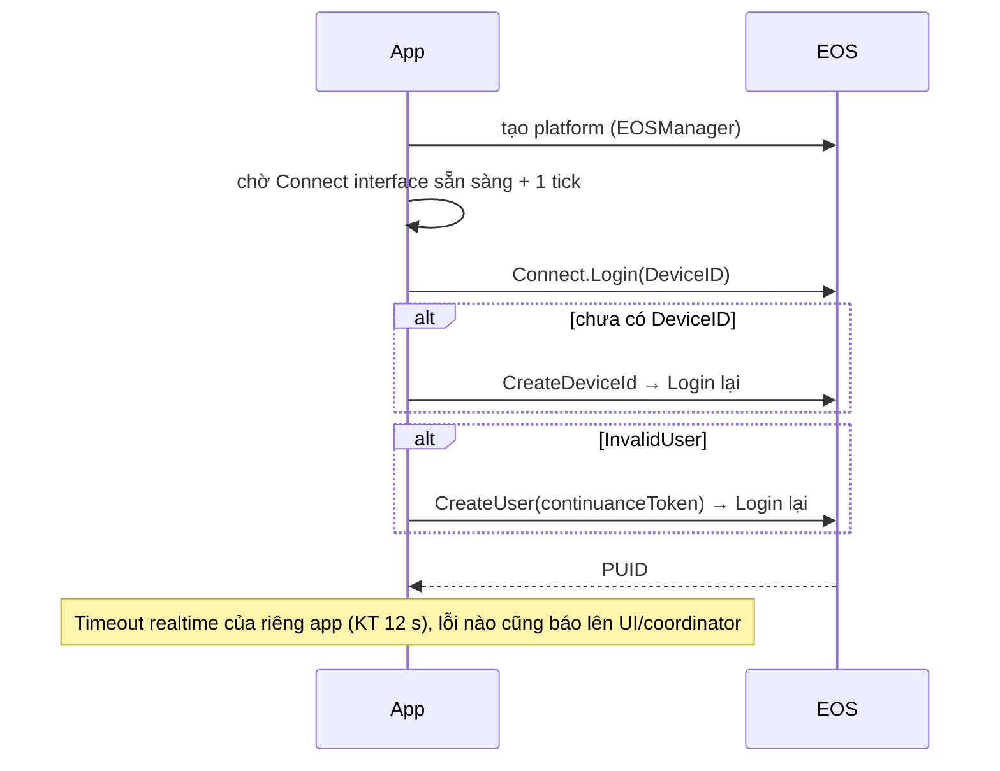
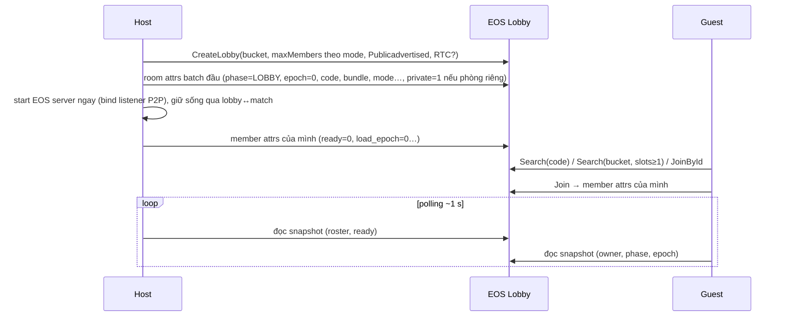
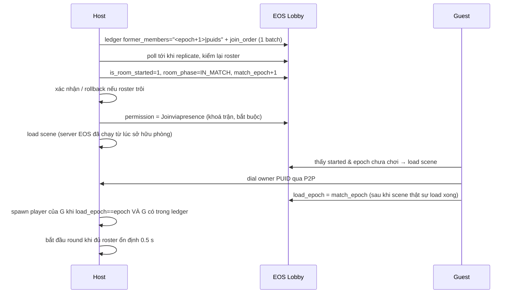

# 01 — Kiến trúc tổng thể: host P2P qua EOS

> Mục đích: bức tranh toàn hệ — các tầng, ai sở hữu gì, luồng chính từ boot tới rematch.
> Baseline: KT commit `7d96acd5` (HEAD 2026-10-05).
> Đọc khi: bắt đầu dự án mới (mọi engine), trước khi đọc `02-room-protocol.md`.

## 1. Topology

- **Host = chủ lobby EOS** (owner). Client dial PUID của owner (`KT:Assets/Scripts/Net/SessionOrchestrator.cs:787`).
- **Không host migration.** Host rời = trận kết thúc cho mọi người (`KT:Assets/Scripts/Net/LobbyMatchPolicy.cs:679` — "Host migration is not productized").
- **Solo chạy cùng code** trên host local (loopback), không qua EOS (`KT:Assets/Scripts/Net/SessionOrchestrator.cs:509` `StartLocalHost`).

## 2. Năm tầng và ranh giới [GENERIC]

| Tầng | Trách nhiệm | KT hiện tại | Engine khác cần |
|---|---|---|---|
| 1. Identity | Đăng nhập EOS → PUID; ánh xạ PUID ↔ uid backend game | FishyEOS auth coroutines + `SessionOrchestrator.InitEosAsync`; uid backend chỉ đi kèm trong member attr | Connect DeviceID login, bounded timeout |
| 2. Lobby | Tạo/vào/rời phòng, attributes, tìm phòng, kick | `EosLobbyService` + `EosLobbyOperationOwnership` | Lobby interface + giao thức `02` + pattern `03` |
| 3. Transport | Kênh P2P host↔client, liveness, reconnect | FishyEOS (đã vá) trong Multipass[Tugboat, FishyEOS] | EOS P2P send/receive + bài học bản vá FishyEOS |
| 4. Session / barrier | Epoch, ledger, start/load/return barrier, rejoin | `ProductLobbySession`, `SessionOrchestrator`, `EpochPhaseCoordinator`, `RejoinAdmission`, `PlayerSpawnService` | Port nguyên ngữ nghĩa — đây là phần dễ sai nhất |
| 5. Gameplay | Replication, authority, spawn, state | FishNet NetworkBehaviour (xem `unity/gameplay-replication.md`) | Tự viết lớp message host-authoritative (xem `cocos/native-eos-design.md`) |

Quy tắc phụ thuộc: tầng dưới không biết tầng trên. Luật game (mode, nhân vật, map) chỉ đi vào qua attribute `game_*` (`02` §2.3) và interface do game cấp.

## 3. Mô hình authority [GENERIC]

| Thứ | Ai quyết | Ghi chú |
|---|---|---|
| Vị trí nhân vật | Client sở hữu (client-authoritative) | KT: NetworkTransform client-auth, 30 Hz, không prediction (`KT:Assets/Prefabs/Player.prefab:241-243`) |
| Hành động (nhặt, chặt, ném, giao) | Host | Client gửi yêu cầu; host kiểm tầm với/tần suất/NaN (`KT:Assets/Scripts/Gameplay/Player/PlayerController.cs:780-855`) |
| Trạng thái thế giới (đồ vật, đơn hàng, điểm, đồng hồ) | Host | Replicate xuống client; client chỉ hiển thị |
| Thành viên phòng, epoch, phase | Host ghi room attr; mỗi người tự ghi member attr của mình | Danh tính = PUID do EOS xác thực, không tin trường tự khai |
| Kết quả có giá trị (ranked, thưởng) | **Server game** | Host P2P không đáng tin |

## 4. Luồng chính

### 4.1 Boot + đăng nhập

Nguồn: `KT:Assets/Scripts/Core/AppConfig.cs:451,796` (task "Init EOS" critical, retry), `KT:Assets/Scripts/Net/SessionOrchestrator.cs` `InitEosAsync`. Vì sao không dùng timeout của FishyEOS: xem `03-robustness-patterns.md` §Auth bootstrap.

### 4.2 Tạo / vào phòng

### 4.3 Bắt đầu → load → spawn

Chi tiết, thứ tự chính xác và các ngoại lệ: `02-room-protocol.md` §6–7; khoá/mở phòng `02` §4.

**Khi nào host start server [GENERIC, quy tắc dự án mới]:** host start EOS server (listener P2P đã bind) **ngay khi sở hữu phòng** (sau create / khi xác nhận mình là owner, kể cả khi được promote) và giữ nó sống xuyên lobby↔match (persistent peer, §4.4) — luôn **trước** mọi tín hiệu begin/co-load. KT start server khi scene match load (`KT:Assets/Scripts/Net/SessionOrchestrator.cs:777-784`) ⇒ guest dial trước khi listener bind ⇒ host log `UNKNOWN SOCKET`, EOS vứt lời mời, guest kẹt `Starting` (bug C8; `KT:plans/260904-0443-coop-join-kick-fixes/phase-05-p2-host-listener-bind-order.md`, KT **chưa sửa**). Quy tắc này CHƯA KIỂM CHỨNG trên thiết bị (KT chưa ship bản sửa).

### 4.4 Hết trận → về phòng → rematch
Host ghi `is_room_started=0`, `room_phase=LOBBY`, **giữ `match_epoch`**. Kết nối P2P sống qua scene → rematch dùng lại link (phải chặn object tới peer chưa load: `MatchLoadObserverCondition`). Chỉ peer thật sự về lobby mới được đổi phase.

### 4.5 Mất kết nối / rejoin
- Client: vòng re-dial (check 2 s, stall 12 s, bỏ cuộc 90 s → sự kiện `ClientReconnectGaveUp`, `KT:Assets/Scripts/Net/SessionOrchestrator.cs:127,959`).
- Disconnect handler phải bỏ qua `Stopped` do chính mình gây ra khi re-dial (`KT:Assets/Scripts/UI/Screens/GameHUD/MatchLeaveNotifier.cs:141,193`).
- Rejoin sau khi mở lại app: roomId đã lưu lúc vào phòng → JoinById → thấy trận đang chạy → co-load → dial → publish `load_epoch` → host spawn lại.
- Host mất: client về menu với thông báo phòng đã đóng.

## 5. Bản đồ code KT theo tầng (để tra cứu)

| Tầng | File chính (`KT:Assets/Scripts/Net/` trừ khi ghi khác) |
|---|---|
| Identity | `DevelopmentEosAuth.cs`, `LocalPlayerIdentity.cs`, FishyEOS `Util/EOS.cs`, `Util/Coroutines/*` |
| Lobby | `EosLobbyService.cs`, `EosLobbyOperationOwnership.cs`, `ILobbyService.cs`, `LobbyAttributes.cs`, `RoomCodeGenerator.cs`, `RandomMatchPolicy.cs`, `RoomVisibility.cs`, `Invite/InviteSession.cs`, `LobbyChatChannel.cs` |
| Transport | FishyEOS `Core/*`, `TransportRoutingPolicy.cs`, `IRoomTransport.cs`, `IP2PBoundary.cs`, `EosP2PBoundary.cs`, `ConnectionProbe.cs`, `PersistentPeerReuse.cs`, `AppLifecycleRecovery.cs` |
| Session | `ProductLobbySession.cs` (luồng sản phẩm), `SessionOrchestrator.cs` (transport + luồng "gym"), `EpochPhaseCoordinator.cs`, `MatchRosterHandoff.cs`, `RejoinAdmission.cs`, `MatchReturnQuorum.cs`, `PostMatchPartyPolicy.cs`, `GenerationGuard.cs`, `LobbyConnectWatchdog.cs` |
| Gameplay | `PlayerSpawnService.cs`, `MatchLoadObserverCondition.cs`, `KT:Assets/Scripts/Gameplay/**` (RoundController, OrderService, KitchenObject, PlayerController) |

**Cảnh báo cấu trúc KT:** có **hai** stack phiên song song — luồng sản phẩm (`ProductLobbySession` + `LobbySessionIntent`) và luồng "gym" (`SessionOrchestrator` + `RoomIntentCoordinator`). Một số cơ chế (ẩn phòng khi đấu, rejoin gate, return quorum) **chỉ chạy ở luồng gym**. Dự án mới: **một** session owner duy nhất (xem `KT:docs/multiplayer-modules/architecture.md` §Một owner).
