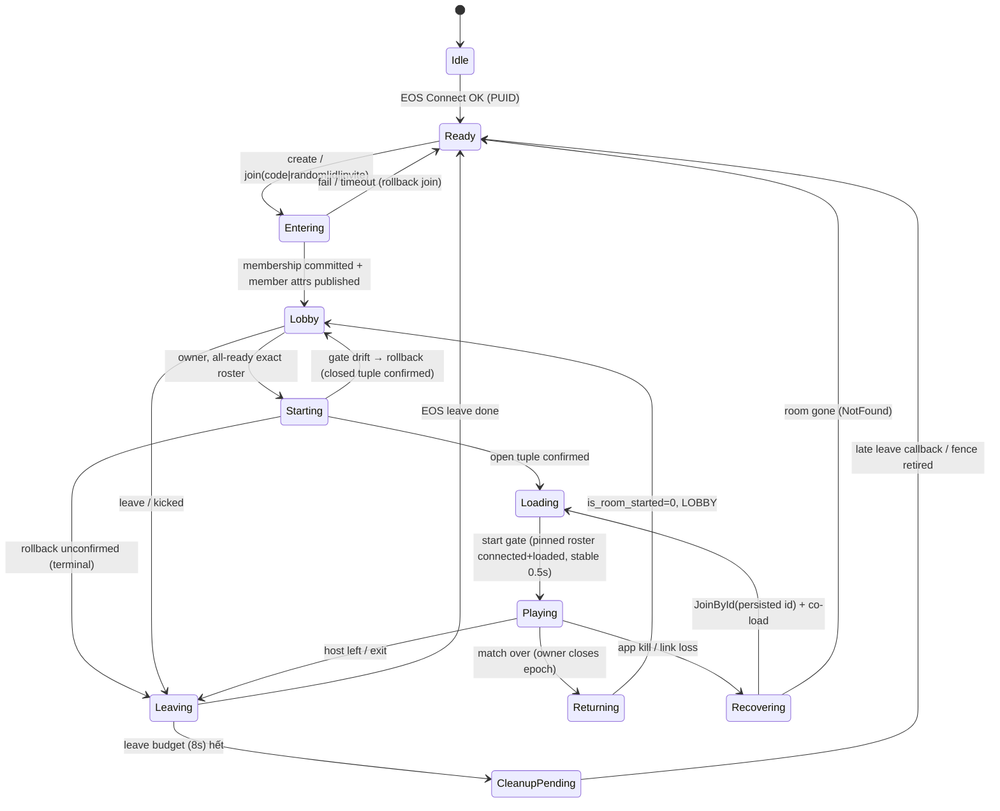

# 02 — Room protocol (EOS Lobby làm phòng + state store, không game server)

> **Mục đích:** đặc tả giao thức phòng engine-agnostic (state machine, attribute schema, entry paths, barrier start/load/return, rejoin, kick) để port sang Unity/Cocos mà không cần đọc code KT.
> **Baseline:** KT commit `7d96acd5` (HEAD 2026-10-05). Trích dẫn `KT:<path>:<line>` tương đối từ root repo Kitchen-Together-Unity.
> **Ai đọc:** dev implement lớp room/lobby (Unity 6, Cocos2d-x/Creator native); reviewer cần biết KT làm gì thật và chỗ nào KHÔNG được chép.

Nhãn: **[GENERIC]** = phần giao thức nên giữ ở mọi game · **[KT-SPECIFIC]** = chỉ KT dùng · **CHƯA KIỂM CHỨNG** = chưa có bằng chứng code/đo.

---

## 0. Mô hình tóm tắt [GENERIC]

| Vai trò | Thực thể |
|---|---|
| Identity | EOS ProductUserId (PUID) — opaque string, alphanumeric. Không dùng display name / game uid làm khoá. |
| Phòng | 1 EOS Lobby. `lobbyId` (32 char) là room id bền. |
| Host | **EOS lobby owner**. Owner chạy FishNet server+client (host mode); guest dial PUID của owner qua EOS P2P. |
| State store | Lobby attributes: **room-scope** (chỉ owner ghi) + **member-scope** (mỗi member tự ghi của mình). Mọi barrier đọc từ đây, không dựa RPC. |
| Đồng bộ | Poll `GetMembers()`/attributes mỗi 1s (`KT:Assets/Scripts/Net/ProductLobbySession.cs:2355`). Ghi = `UpdateLobby` (1 batch/lần). |

---

## 1. State machine phòng

| State | KT thực tế | Bằng chứng |
|---|---|---|
| Idle→Ready (auth) | CÓ (EOS Connect, DeviceID) — chi tiết ở reference auth | — |
| Entering | CÓ. Watchdog join-by-id 25s, create/random 30s | `KT:Assets/Scripts/Net/ProductLobbySession.cs:44`, `:53` |
| Lobby | CÓ. Roster poll 1s; ready = member `ready_status` | `ProductLobbySession.cs:1025`, `:2355` |
| Starting | CÓ, đầy đủ nhất (xem §6) | `ProductLobbySession.cs:1291-1521` |
| Loading | CÓ (co-load khi room started) | `KT:Assets/Scripts/UI/Screens/Lobby/LobbyScreen.cs:1114` |
| Playing | CÓ (start gate host) | `KT:Assets/Scripts/Gameplay/Orders/RoundController.cs:326` |
| Returning | CÓ nhưng **không có barrier** ở product path: owner ghi closed tuple khi MatchOver | `KT:Assets/Scripts/Gameplay/HUD/HudController.cs:1001` |
| Recovering | MỘT PHẦN: rejoin qua "Continue" lúc relaunch; client redial watchdog (check 2s, redial 12s, bỏ 90s) | `KT:Assets/Scripts/Net/SessionOrchestrator.cs:908-913` |
| Leaving | CÓ, budget 8s | `ProductLobbySession.cs:59` |
| CleanupPending | MỘT PHẦN: pending-leave fence trong `EosLobbyOperationOwnership` | `KT:Assets/Scripts/Net/EosLobbyService.cs:1454` |
| AuthSettling / ShuttingDown / Disposed | ĐỀ XUẤT (chỉ có trong design doc) | `KT:docs/multiplayer-modules/architecture.md:161-213` |

**[GENERIC] Quy tắc command:** SetReady chỉ ở Lobby; StartMatch chỉ owner ở Lobby; ReportLoaded idempotent theo epoch; Leave nhận được ở mọi state và coalesce theo membership (`architecture.md:203-205`).

---

## 2. Attribute schema

### 2.1 Key thật trong KT (`KT:Assets/Scripts/Net/LobbyAttributes.cs:24-117`)

Mọi value ghi dạng **UTF-8 string**, visibility `Public` (`EosLobbyService.cs:1704-1720`). Room key chỉ owner ghi được (EOS từ chối non-owner).

| Key | Scope | Writer | Format value | Ý nghĩa | Nhãn |
|---|---|---|---|---|---|
| `level` | room | host | int 1-based ("1") | level đã chọn | KT-SPECIFIC |
| `mode` | room | host | label mode (`TwoPlayers`, `FourPlayers`, `TwoVsTwo`, `Singleplay`) | lọc random match + cap | GENERIC (giá trị KT) |
| `game_type` | room | host | `story` \| `uia` | guest áp theo | KT-SPECIFIC |
| `owner_name` | room | — | — | **khai báo nhưng không ai ghi** | KT-SPECIFIC (dead) |
| `is_room_started` | room | host | `"1"`/`"0"` | cờ match đang chạy | GENERIC |
| `room_phase` | room | host | `LOBBY` \| `IN_MATCH` | phase phòng | GENERIC |
| `allow_change_scene` | room | — | — | không ai ghi | KT-SPECIFIC (dead) |
| `bundle` | room | host | `Application.version` | random match chỉ ghép cùng build | GENERIC |
| *(đề xuất)* `private` | room | host | `"1"`/vắng | phòng riêng: random match bỏ qua; KT **chưa có** key này (xem §4) | GENERIC (mới) |
| `lobby_map` | room | — | — | không ai ghi | KT-SPECIFIC (dead) |
| `map_id` | room | host | UGC map id | custom map | KT-SPECIFIC |
| `map_hash` | room | host | hash ngắn nội dung map | peer phải khớp trước spawn | KT-SPECIFIC |
| `continent` | room | — | — | không ai ghi | KT-SPECIFIC (dead) |
| `country` | room | — | — | không ai ghi | KT-SPECIFIC (dead) |
| `match_epoch` | room | host | int, đơn điệu tăng, `"0"` lúc tạo | số thứ tự match | GENERIC |
| `join_order_mapping` | room | host | `{"<puid>":0,"<puid>":1}` dense 0..N-1 | slot/spawn order | GENERIC |
| `code` | room | host | 6 ký tự (xem §3.2) | join-by-code | GENERIC |
| `former_members` | room | host | `"<epoch>\|puid,puid,..."` | ledger participant của match | GENERIC |
| `user_name` | member | self | text | tên hiển thị | GENERIC (display) |
| `character_id` | member | self | id skin | | KT-SPECIFIC |
| `equipped_hats` | member | self | id | | KT-SPECIFIC |
| `equipped_glasses` | member | self | id | | KT-SPECIFIC |
| `user_id` | member | self | game/social uid | tra cứu backend game; **không dùng làm identity** | GENERIC (optional) |
| `gender` | member | self | text | | KT-SPECIFIC |
| `chat_0..chat_3` | member | self | `v1\|<session>\|<seq>\|<text>` | mailbox xoay vòng 4 ô, sender = member PUID | GENERIC (optional) |
| `ready_status` | member | self | `"1"`/`"0"` | ready | GENERIC |
| `client_phase` | member | self | `LOBBY` \| `IN_MATCH` | phase của client | GENERIC |
| `load_epoch` | member | self | int; `"0"` khi join/begin | epoch client đã load xong | GENERIC |
| `map_download_capability` | member | self | `v1\|A\|D\|<hash>\|<mapId>` (A=allow, D=deny) | host cần ALLOW của mọi member trước begin custom map | KT-SPECIFIC |

Nguồn format: chat `KT:Assets/Scripts/Net/LobbyChatChannel.cs:106-107`; capability `LobbyAttributes.cs:156-161`; ledger `LobbyAttributes.cs:237-255`; join order `LobbyAttributes.cs:343-355`; level `KT:Assets/Scripts/Net/LobbyMatchPolicy.cs:602-606`; game_type `KT:Assets/Scripts/Net/UiaSessionIntent.cs:13-14`; seed lúc host tạo phòng (`level, mode, bundle, is_room_started=0, room_phase=LOBBY, match_epoch=0, game_type`) `ProductLobbySession.cs:2261-2273`; member attrs khi join (kể cả `load_epoch=0`, chat rỗng) `ProductLobbySession.cs:2190-2205`.

Ngoài attribute: EOS **BucketId** `kt-lobby` (`EosLobbyService.cs:29`), search bằng key `bucket` (`:293-302`). Cách chọn bucket cho dự án mới: §3.1.

### 2.2 Giới hạn EOS

| Giới hạn | Giá trị | Nguồn |
|---|---|---|
| Số attribute / lobby modification | 64 (`LOBBYMODIFICATION_MAX_ATTRIBUTES`) | SDK `KT:Library/PackageCache/com.playeveryware.eos@*/Runtime/EOS_SDK/Generated/Lobby/LobbyInterface.cs:205-209`; KT nhắc lại ở `LobbyAttributes.cs:215` |
| Độ dài **tên** attribute | 64 ký tự (`LOBBYMODIFICATION_MAX_ATTRIBUTE_LENGTH` — doc comment SDK: "length of the **name**", không phải value) | `LobbyInterface.cs:210-213`; `LobbyAttributes.cs:216` |
| Độ dài value | SDK không có hằng cho value. KT production ghi thành công `former_members` tới 4 PUID (~140 ký tự) và JSON `join_order_mapping` ⇒ value > 64 ký tự chạy được. Trần chính xác: CHƯA KIỂM CHỨNG | `LobbyAttributes.cs:237-255`, `:343-355` |
| Member tối đa / lobby | 64 (`MAX_LOBBY_MEMBERS`) | `LobbyInterface.cs:286-289` |
| Kết quả search tối đa | 200 (`MAX_SEARCH_RESULTS`) | `LobbyInterface.cs:290-293` |
| Rate limit `UpdateLobby` | EOS throttle khi ghi dày; review đã chỉ ra vòng retry 1.5s có thể làm host bị throttle/soft-lock. Con số quota CHƯA KIỂM CHỨNG | `KT:plans/260715-2039-lobby-room-session/reports/from-code-reviewer-to-cook-260716-2110-s4-ready-funnel-review-report.md:19` |

**[GENERIC] Luật ghi:** gom nhiều key vào **1 batch / 1 UpdateLobby**; retry có trần (KT gym: `MaxStartAttempts = 3`, `SessionOrchestrator.cs:1510`); không ghi theo tick.

### 2.3 Đề xuất namespace chuẩn [GENERIC]

**Quy tắc chốt (mọi dự án mới, Unity lẫn Cocos):** dùng **đúng hằng số `LobbyKeys` của template** (`assets/unity/Core/LobbyProtocol.cs` — tên kiểu KT, snake_case, không prefix: `mode, bundle, is_room_started, room_phase, match_epoch, join_order_mapping, code, former_members, private`; member `user_id, client_phase, load_epoch` + `ready_status, user_name`). Lý do: Core + 113 test là spec chạy được, và Unity ↔ Cocos cùng một wire. Key protocol mới (vd `proto_major`) thêm vào `LobbyKeys` cùng kiểu tên; key game đặt qua `ILobbyKeySchema`, nên có tiền tố `game_` để không đụng key protocol. Dấu `.` trong tên attribute EOS CHƯA KIỂM CHỨNG — không dùng. Tên ≤ 64 ký tự (§2.2).

Bảng dưới **chỉ là đề xuất cho wire v1 tương lai** (đổi đồng loạt mọi client, không trộn với tên hiện tại):

| Key chuẩn | Scope | KT key | Ghi chú |
|---|---|---|---|
| `mp_proto` | room | *(không có)* | AppProtocolId + wire major; KT chỉ có `bundle` |
| `mp_bundle` | room | `bundle` | build/content version |
| `mp_mode` | room | `mode` | |
| `mp_phase` | room | `room_phase` (+ `is_room_started`) | KT dư thừa 2 key; chuẩn nên 1 key |
| `mp_epoch` | room | `match_epoch` | |
| `mp_ledger` | room | `former_members` | |
| `mp_join_order` | room | `join_order_mapping` | |
| `mp_code` | room | `code` | |
| `mp_ready` | member | `ready_status` | |
| `mp_client_phase` | member | `client_phase` | |
| `mp_load_epoch` | member | `load_epoch` | |
| `mp_name` | member | `user_name` | |
| `mp_chat0..3` | member | `chat_0..chat_3` | optional |
| `private` (đề xuất wire v1: `mp_private`) | room | *(không có)* | `"1"` = phòng riêng (§4). **Tên chốt hiện tại: `private`** — khớp template Unity (`LobbyKeys.Private`) và kiểu tên legacy KT; chỉ đổi sang `mp_private` khi cả dự án chuyển wire v1 |
| `game_*` | room/member | `level, game_type, map_id, map_hash, character_id, equipped_hats, equipped_glasses, gender, user_id, map_download_capability` | [KT-SPECIFIC] |
| — | — | `owner_name, allow_change_scene, lobby_map, continent, country` | dead keys, đừng port |

---

## 3. Entry paths

### 3.1 Create [GENERIC] (`EosLobbyService.cs:175-249`)

| Tham số | Giá trị KT |
|---|---|
| BucketId | `kt-lobby` mặc định |
| PermissionLevel | **luôn** `Publicadvertised` (`:189`) — KT bỏ qua `LobbyConfig.IsPublic` (lỗi lịch sử, §12 #2); dự án mới cũng tạo `Publicadvertised`, private làm bằng attribute (§4) |
| MaxLobbyMembers | theo mode: Singleplay 1, TwoPlayers 2, FourPlayers 4, TwoVsTwo 4, mặc định 4 (`KT:Assets/Scripts/Net/GameMode.cs`, `LobbyMatchPolicy.cs:161-167`) |
| PresenceEnabled / AllowInvites | false / true |
| EnableRTCRoom | theo feature flag voice (`:194`) |
| Sau create | owner = local; seed room attrs (§2.1) → publish member attrs → sinh `code` và ghi (`ProductLobbySession.cs:2085-2093`). Dự án mới: phòng riêng thì `private="1"` nằm **trong batch attribute đầu tiên** sau create (cùng seed), để không có khoảnh khắc random match thấy phòng như phòng công khai |

**BucketId cho dự án mới [GENERIC]:** một bucket cho mỗi game + major của wire protocol, vd `<game>-v1`; tăng (`<game>-v2`) khi giao thức phòng/wire đổi không tương thích ngược, để build cũ và mới không bao giờ thấy phòng của nhau. KT dùng `kt-lobby` (không có số version — `bundle` gánh việc lọc build). Hai build khác bucket = không tìm thấy phòng nhau (`05` §5).

### 3.2 Join by code [GENERIC]

- Code: 6 ký tự từ alphabet 31 glyph `ABCDEFGHJKMNPQRSTUVWXYZ23456789` (bỏ 0/O/1/I/L) (`KT:Assets/Scripts/Net/RoomCodeGenerator.cs`). ~8.9e8 tổ hợp.
- Join: `LobbySearch` MaxResults=1, param `code == <typed>` → lấy result 0 → join (`EosLobbyService.cs:402-431`, `:936-975`).
- **KT không check trùng code.** Khuyến nghị: sau khi ghi code, search lại code đó; nếu >1 lobby thì sinh code mới (retry ≤3). Search code chỉ thấy phòng `Publicadvertised` — vì vậy phòng đang khoá trận (`Joinviapresence`, §4) không vào được bằng mã, còn phòng `private=1` ở lobby thì **vào được** bằng mã (đúng ý đồ).

### 3.3 Random match [GENERIC] (`EosLobbyService.cs:281-399`)

1. Search MaxResults=20, `bucket == kt-lobby`, `SEARCH_MINSLOTSAVAILABLE >= 1` (server-side).
2. Lọc client-side `RandomMatchPolicy.IsJoinable` (`KT:Assets/Scripts/Net/RandomMatchPolicy.cs`): loại nếu slot=0; `is_room_started=="1"`; `mode` khác (phòng không có mode cũng loại); `bundle` khác (thiếu bundle thì chấp nhận). Dự án mới thêm: loại nếu `private=="1"` (KT chưa có).
3. Thử join lần lượt; lỗi thì sang ứng viên tiếp, trừ `stale`/`cancelled`.
4. Hết ứng viên → lỗi `not-found`/`LobbyTooManyPlayers`/`LobbyLobbyAlreadyExists`/`NotFound` ⇒ **tự host phòng mới** (`RandomMatchPolicy.ShouldCreateAfterJoinFailure`; `ProductLobbySession.cs:2103-2125`).

### 3.4 JoinById [GENERIC]

Search `SetLobbyId(lobbyId)` rồi join (`EosLobbyService.cs:251-273`). Dùng cho rejoin và invite. Hoạt động với `Publicadvertised` và `Joinviapresence`, bị chặn với `Inviteonly` (§4).

### 3.5 Invite — PORT do backend game cung cấp [GENERIC contract, transport KT-SPECIFIC]

KT **không dùng EOS Custom Invite**; gửi qua kênh chat của backend game riêng (`KT:Assets/Scripts/Net/Invite/InviteSession.cs:9-10`). Engine mới chỉ cần một port `SendInvite(friendUid, payload)` / `OnInvite(payload)`.

| Mục | Giá trị |
|---|---|
| Payload | `{"type":"invite_join_room","mode":"<mode>","roomId":"<lobbyId>","v":1}` |
| Gate gửi (thứ tự) | roomId rỗng → connect đang chạy → hết ghế (`maxMembers − liveMembers ≤ 0`) → target rỗng → tự mời mình → phase ≠ `LOBBY` → cooldown 7s/friend (`InviteSession.cs:145-174`) |
| Chống rác | content > 4096 ký tự bị bỏ; field > 256 bị cắt/từ chối (`:58-61`) |
| Nhận | parse → `JoinById(roomId)` |

---

## 4. Visibility (đo trên 2 thiết bị, 260717) (`KT:Assets/Scripts/Net/RoomVisibility.cs:5-19`)

| EOS PermissionLevel | Stranger search (bucket/code) | Non-member JoinById |
|---|---|---|
| `Publicadvertised` | thấy (lộ roster/PUID) | Success |
| `Inviteonly` | không | **SessionsNotAllowed** |
| `Joinviapresence` | không | Success |

**Quy tắc [GENERIC] cho dự án mới:**

1. **Tạo phòng luôn `Publicadvertised`** (cả phòng công khai lẫn riêng).
2. **Khoá trận — BẮT BUỘC:** ngay sau khi open tuple của begin được **confirm** (§6 bước 9–10) chuyển `Joinviapresence` (ẩn khỏi search/mã, member cũ vẫn rejoin bằng id); khi về lobby (closed tuple confirm) trả `Publicadvertised`. Không khoá trước begin: begin fail sẽ để phòng bị ẩn mà vẫn ở lobby. Lý do bắt buộc: KT product path không bao giờ khoá (§12 #1) ⇒ người lạ có mã vào được trận đang chạy.
3. **Không bao giờ dùng `Inviteonly`** — nó chặn rejoin bằng id.
4. **Phòng riêng (private) = ẩn khỏi random match nhưng vào được bằng mã/lời mời.** Session owner ghi room key `private="1"` trong **batch attribute đầu tiên** sau create (§3.1); `RandomMatchPolicy` bỏ qua phòng `private=1` (§3.3); cờ **giữ nguyên** qua các trận/rematch (không reset khi về lobby). Permission vẫn theo luật 1–2, không dùng permission để làm private.
   - Rủi ro còn lại: (a) đây chỉ là lọc client-side — ai search bucket thô vẫn thấy phòng (và roster/PUID) khi phòng ở lobby; (b) người lạ đoán trúng mã 6 ký tự (~8.9e8 tổ hợp, §3.2) vẫn vào được. Cần chặn cứng hơn ⇒ ban-list/duyệt của owner (`06` §8), CHƯA có trong KT.
   - Lịch sử KT: UI có toggle "Public Room" nhưng `LobbyConfig.IsPublic` bị bỏ qua — mọi phòng KT là public (§12 #2).

---

## 5. Client tìm host [GENERIC]

1. Host = EOS lobby owner, đọc bằng `LobbyDetails.GetLobbyOwner` ngay trong callback join (`EosLobbyService.cs:962-963`, gán `_ownerPuid` ở `:1169`; create gán local ở `:240`). KT chỉ đọc **một lần** rồi cache (lỗi, §11). Dự án mới: đọc lại `GetLobbyOwner` **mỗi lần poll** snapshot.
2. Khi scene match lên: chờ owner PUID hợp lệ tối đa **10s** (`ProductOwnerResolveTimeoutSeconds`, `SessionOrchestrator.cs:694`, vòng chờ `:751-767`). Hết hạn → lỗi, không đoán vai (đoán sai = không ai host hoặc 2 host).
3. `isOwner` → start server + local client; ngược lại set remote PUID = owner, dial, và giao cho watchdog "retry until established" vì host có thể load scene chậm hơn (`SessionOrchestrator.cs:777-796`).
4. **Dự án mới:** host phải start EOS server (listener P2P đã bind) ngay khi sở hữu phòng — không đợi scene match như KT ở bước 3 — vì bind muộn làm EOS vứt lời mời của guest (`UNKNOWN SOCKET`, bug C8, KT chưa sửa). Chi tiết `01` §4.3; CHƯA KIỂM CHỨNG trên thiết bị.

---

## 6. Start barrier (owner) — thứ tự đúng code

Product path: `ProductLobbySession.BeginMatchCoreAsync` (`ProductLobbySession.cs:1320-1521`). Confirm = poll snapshot 41 mẫu cách 50ms (~2s) (`:60-63`, `:1590-1602`).

| # | Bước | Dòng |
|---|---|---|
| 0 | Chặn nếu đang terminal-failure hoặc begin khác đang chạy | `:1293-1303` |
| 1 | Chuẩn hoá roster gated (PUID); PvP cần đúng 4; multiplayer ≥2 | `:1322-1341` |
| 2 | Kiểm owner context + **exact ready roster** (tập PUID ready == tập gated) | `:1350-1358`, `:1777-1783` |
| 3 | `nextEpoch = match_epoch + 1`; tính `join_order_mapping` (host đứng đầu, người cũ giữ thứ tự) | `:1366-1378` |
| 4 | **1 batch**: `join_order_mapping` + `former_members="<nextEpoch>\|puid,.."` | `:1379-1385` |
| 5 | Poll đến khi replicate thấy đúng mapping (fail → ở lại lobby, epoch chưa mở) | `:1393-1401` |
| 6 | Recheck: context, epoch chưa đổi, exact ready roster | `:1403-1412` |
| 7 | **Begin** (1 batch, `EpochPhaseCoordinator.BeginMatchAsync`): room `is_room_started=1`, `room_phase=IN_MATCH`, `match_epoch=next`; member host `client_phase=IN_MATCH`, `load_epoch=0` | `KT:Assets/Scripts/Net/EpochPhaseCoordinator.cs:49-58` |
| 8 | Write lỗi/bị từ chối → đọc lại: nếu backend đã mở thì **rollback** về closed tuple; không xác nhận được → terminal | `:1418-1471` |
| 9 | Confirm open tuple (`1`, `IN_MATCH`, `epoch==next`); timeout → terminal | `:1473-1490`, `:1717-1725` |
| 10 | Recheck lần cuối; drift → rollback (`ReturnToLobbyAsync` + confirm closed tuple `0`/`LOBBY`/`epoch==next`), rollback không confirm → terminal teardown | `:1492-1508`, `:1528-1581` |
| 10b | **Dự án mới, bắt buộc (KT product thiếu):** lock `Joinviapresence` sau khi bước 9–10 pass; lock fail → retry có trần, không rollback trận (§4 luật 2) | không có trong KT product (§12 #1) |
| 11 | `MatchRosterHandoff.Commit(lobbyId, epoch, puids)` — bản process-local của ledger sống qua scene unload | `:1510`, `KT:Assets/Scripts/Net/MatchRosterHandoff.cs:9-13` |
| 12 | Caller co-load scene | `LobbyScreen.cs:1268-1275` |

Trước BeginMatch, LobbyScreen ghi `level` và (custom map) yêu cầu capability quorum ALLOW đủ [KT-SPECIFIC] (`LobbyScreen.cs:597-599`, `:1258-1266`).

> Gym path (`SessionOrchestrator.BeginMatchFlowAsync`, `:1517-1570`) làm thứ tự KHÁC: ghi `level` → begin epoch → lock `Joinviapresence` → ghi ledger snapshot **sau** lock. Không confirm/rollback. Đừng lấy làm mẫu; product path mới là chuẩn.

---

## 7. Load barrier [GENERIC]

| Bước | Ai | Quy tắc | Dòng |
|---|---|---|---|
| Co-load | mọi peer | load scene khi `is_room_started=="1" && room_phase=="IN_MATCH"` && chưa load && epoch hiện tại **chưa** finished cục bộ | `LobbyMatchPolicy.cs:274-277`, `LobbyScreen.cs:1109-1127` |
| Báo loaded | mọi peer | chỉ khi scene **thật sự** lên (hook scene-arrived, không phải lúc gọi load): member `load_epoch = match_epoch`, idempotent/epoch | `ProductLobbySession.cs:1822-1833`, `SessionOrchestrator.cs:1684-1698` |
| Spawn | host | chỉ cấp player cho connection có `load_epoch == match_epoch` (map clientId→PUID qua transport top-level) | `SessionOrchestrator.cs:1612-1640`, `ProductLobbySession.cs:1856-1866` |
| Start gate | host | `RoundController.StartWhenPartyConnected`: roster pinned (ledger/handoff); cần mọi PUID pinned **connected + loaded**, ổn định **0.5s**; bớt người chỉ khi removal được xác nhận ≥**1s**; timeout 20s chỉ log + retry, **không bao giờ start do timeout** | `RoundController.cs:313-421` |
| Finished | mọi peer | Results "Next" ghi `finishedEpoch` để không co-load lại match đã xong | `ProductLobbySession.cs:1843-1853` |

---

## 8. Return / rematch

| Mục | KT product | Dòng |
|---|---|---|
| Đóng epoch | owner, khi MatchOver: `is_room_started=0`, `room_phase=LOBBY`, `client_phase=LOBBY`; **giữ `match_epoch`** (đơn điệu) | `EpochPhaseCoordinator.cs:78-84`, `HudController.cs:1001` |
| Zombie room | owner thấy phòng còn IN_MATCH cho epoch mình đã finished → tự đóng epoch | `LobbyScreen.cs:987-996`, `:1091-1106` |
| Party còn sống? | `PostMatchPartyPolicy`: không trong lobby → Leave; local vắng hoặc 0 member → Wait (đọc rỗng = unknown); >1 member → Keep; chỉ còn mình ở **2 poll khác version** → Leave (về menu). Tối đa 6 lần × 1s rồi báo lỗi | `KT:Assets/Scripts/Net/PostMatchPartyPolicy.cs`, `KT:Assets/Scripts/UI/Screens/Results/ResultsUiUtil.cs:98-125` |
| Ready reset | ready không carry sang rematch (ghi `ready_status=0`) | `SessionOrchestrator.cs:1716-1718` |
| Return quorum | `MatchReturnQuorum` (5s) + `ClientReturnFallback` — **chỉ gym path** (`SessionOrchestrator`), product không có | `SessionOrchestrator.cs:1015-1020`, `:1771-1800` |
| Unlock visibility | gym path trả `Publicadvertised` (`:1727`); product không cần vì chưa từng lock (lệch, §12) | |

---

## 9. Ledger rules [GENERIC — quan trọng nhất]

Lý do: **mọi join ghi `load_epoch=0`** (`ProductLobbySession.cs:2200`) và **FishNet disconnect không xoá EOS member** (member EOS sống lâu hơn link P2P). Nếu barrier đếm "mọi member", một stranger join bằng code hoặc một ghost đã kill app sẽ giữ barrier false mãi (remote DoS).

| Luật | Nguồn |
|---|---|
| Ledger `former_members` = snapshot PUID participant, **stamp epoch**, ghi trước khi mở epoch | `LobbyAttributes.cs:219-237` |
| Ledger có epoch ≠ `match_epoch` hiện tại → coi như không có | `EpochPhaseCoordinator.cs:138-142` |
| Barrier chỉ đếm member ∈ ledger **và** còn link sống (host cung cấp `isParticipantLive`) | `EpochPhaseCoordinator.cs:150-153`, `:168` |
| Member chưa replicate uid → bỏ qua (không chặn, không tính loaded) | `EpochPhaseCoordinator.cs:148-149` |
| Không có ledger → fallback đếm mọi member (hành vi cũ) — chỉ nên là đường lùi | `EpochPhaseCoordinator.cs:133-137` |
| Product: start gate dùng roster pinned từ `MatchRosterHandoff`/ledger + tập connected thực | `ProductLobbySession.cs:1789-1807` |

Lưu ý: product tạo `EpochPhaseCoordinator` **không** truyền `isParticipantLive` (`ProductLobbySession.cs:267`, `:959`); liveness ở product nằm trong RoundController (tập connected).

---

## 10. Rejoin [GENERIC]

| Bước | Quy tắc | Dòng |
|---|---|---|
| Lưu id | khi join/create commit thành công: persist `lobbyId` (key save `last_room_id`) — cả host và guest | `ProductLobbySession.cs:2288-2293`, `KT:Assets/Scripts/Save/Core/SaveData.cs:54` |
| Xoá id | **chỉ** khi leave chủ động hoặc bị kick (kill/crash giữ lại) | `ProductLobbySession.cs:751-753`, `:2411-2412` |
| Relaunch | popup "Continue" → xoá id (one-shot) → `JoinById` + `IsRejoinAttempt=true` → lobby; room còn started → co-load thẳng; fail → về menu | `KT:Assets/Scripts/UI/Screens/MainMenu/MainMenuScreen.cs:884-901`, `LobbyScreen.cs:683-711` |
| Gate host `RejoinAdmission.Decide` | lobby phase → Allow; host local → Allow; PUID chưa resolve → Unknown (retry ≤10 tick × 0.1s rồi reject); trong grace 2s sau start → Allow; ledger thiếu/sai epoch → Allow; còn lại Allow nếu PUID ∈ ledger, ngược lại Reject (disconnect) | `KT:Assets/Scripts/Net/RejoinAdmission.cs`, `SessionOrchestrator.cs:1109-1140`, `:1515` |

Hướng lỗi của gate — tách 2 loại bất định: **bất định về ledger** (grace sau start, ledger thiếu/sai epoch) → **Allow** (kick nhầm người thật tệ hơn để lọt người giữ room id); **bất định về danh tính** (PUID chưa resolve sau ~1 s) → **Reject** + disconnect, vì peer không định danh không thể vào barrier (`KT:Assets/Scripts/Net/SessionOrchestrator.cs:1109-1150`). Với EOS P2P thô (Cocos), PUID luôn đi kèm connection request nên nhánh Unknown gần như không xảy ra. Đây là lớp phụ; lớp chính là khoá phòng + ledger-scoped barrier.

---

## 11. Host rời, owner, kick

| Chủ đề | KT | Dòng |
|---|---|---|
| Host rời giữa match | **Terminal**, không host migration. Guest: còn ≥1 người thì "match continues" ở UI nhưng server FishNet đã mất; lobby rỗng → abort về menu | `LobbyMatchPolicy.cs:676-711` |
| Owner mới do EOS promote | EOS tự promote owner, nhưng `OwnerPuid` cache chỉ gán lúc create/join, **không refresh** ⇒ peer được promote không biết mình là owner (BUG) | `EosLobbyService.cs:240`, `:856`, `:1169` |
| Kick | owner gọi EOS `KickMember` | `EosLobbyService.cs:1647-1680` |
| Bị kick phát hiện thế nào | poll roster 1s: local không còn trong member list khi vẫn tưởng in-lobby → toast "removed", xoá `last_room_id`, dọn state | `ProductLobbySession.cs:2405-2420` |

**Quy tắc [GENERIC]:** polling snapshot là **baseline và nguồn sự thật** (KT chỉ ship polling, đã chạy thật; grep `AddNotify` = 0 trong `EosLobbyService.cs`). Mỗi poll đọc lại `GetLobbyOwner` (KT cache một lần = bug) và roster để phát hiện kick. Notify (`AddNotifyLobbyUpdateReceived`, `AddNotifyLobbyMemberUpdateReceived`, `AddNotifyLobbyMemberStatusReceived` — PROMOTED/KICKED/LEFT/CLOSED) là **tối ưu độ trễ tùy chọn**: callback chỉ kích hoạt một lần đọc lại snapshot ngay, **không bao giờ** là nguồn duy nhất và không được bỏ polling (`03` §7). Owner đổi khi đang IN_MATCH → terminal exit (v1).

---

## 12. KT lệch / ĐỪNG CHÉP

| # | Lệch | Bằng chứng | Làm đúng |
|---|---|---|---|
| 1 | Product path **không bao giờ ẩn phòng** khi start: chỉ `SessionOrchestrator` (gym) gọi `SetRoomVisibilityAsync`. Phòng product đang chơi vẫn `Publicadvertised`, stranger tìm bằng code vẫn join được (random match lọc `started` nên không dính) | `SessionOrchestrator.cs:1548`, `:1727`; không có caller trong `ProductLobbySession.cs` | **Bắt buộc** lock `Joinviapresence` ngay sau open tuple confirmed; trả `Publicadvertised` khi closed confirmed (§4 luật 2) |
| 2 | `LobbyConfig.IsPublic` bị bỏ qua — create luôn `Publicadvertised` dù UI có toggle "Public Room" ⇒ phòng "riêng" vẫn bị random match ghép người lạ | `EosLobbyService.cs:189`, `KT:Assets/Scripts/Net/ILobbyService.cs:126-132`, `ProductLobbySession.cs:2050-2058` | Vẫn tạo `Publicadvertised`; ghi `private="1"` trong batch đầu sau create; random match bỏ qua; vẫn vào bằng mã/lời mời (§4 luật 4) |
| 3 | `OwnerPuid` cache không refresh sau promote | §11 | Đọc `GetLobbyOwner` mỗi poll (notify chỉ kích hoạt poll sớm) |
| 4 | `SetRoomVisibilityAsync` không `mod.Release()` (leak handle cả nhánh fail và success); `SetAttributesAsync` thì có | `EosLobbyService.cs:1751-1782` vs `:1713`, `:1737` | Release handle ở mọi nhánh |
| 5 | Rejoin gate + return quorum chỉ chạy ở gym path: `SessionOrchestrator._epoch` chỉ tạo ở `OnJoinedLobbyAsync` (gym) → product luôn `_epoch == null` → `GateRejoiner` thoát ngay | `SessionOrchestrator.cs:1015`, `:878`, `:1116-1117` | Gate + quorum phải gắn vào session thật (một owner) |
| 6 | Join-by-id **NotFound 21.7%** (525/2.417 session/ngày), chưa có root cause | `KT:plans/260904-0443-coop-join-kick-fixes/plan.md:83-84` | Log lý do NotFound (phòng chết vs replicate chậm vs visibility); retry có backoff trước khi báo "room not found" — CHƯA KIỂM CHỨNG hiệu quả |
| 7 | 5 key dead (`owner_name, allow_change_scene, lobby_map, continent, country`) | grep chỉ thấy trong `LobbyAttributes.cs` | Không port |
| 8 | Phase dư thừa: `is_room_started` + `room_phase` luôn ghi cặp | `EpochPhaseCoordinator.cs:54-56` | Hiện tại: giữ ghi cặp như template (cùng wire với Core/test). Wire v1 tương lai: gộp 1 key `mp_phase` |
| 9 | Không check trùng room code | `RoomCodeGenerator.cs:9-12` | Search-after-write + retry |
| 10 | Gym begin flow không confirm/rollback, ghi ledger sau lock | `SessionOrchestrator.cs:1517-1570` | Theo §6 |
| 11 | Hai session song song (`ProductLobbySession` + `SessionOrchestrator`) cùng nắm lobby/epoch | — | Một owner duy nhất cho room state |
